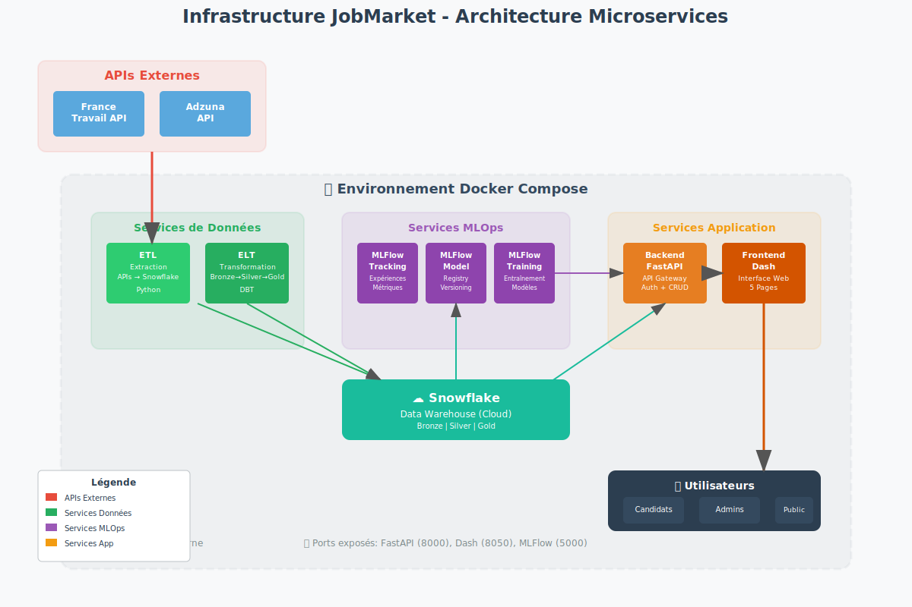
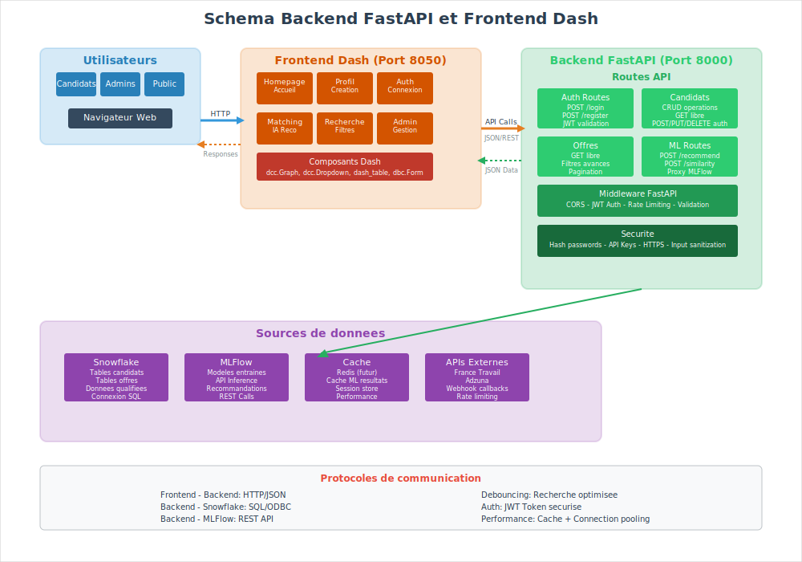

# Compte-rendu de réunion : Conteneurisation de l'infrastructure microservices JobMarket

**Date :** 28 MAI 2025
**Participants :** Arnaud, Ilan, Sambou, Mickael
**Sujet :** Comment organiser notre application avec des conteneurs Docker

## 1. Pourquoi utiliser Docker ?

Notre projet JobMarket utilise plusieurs outils différents (Python, bases de données, machine learning, etc.). Chaque outil a ses propres besoins d'installation et de configuration.

Avec Docker, on peut :

- Mettre chaque outil dans sa propre "boîte" (conteneur)
- Éviter les conflits entre les outils
- Installer le projet facilement sur n'importe quel ordinateur
- Travailler tous avec le même environnement

## 2. Les outils qu'on utilise

- **Snowflake** : Notre base de données principale (dans le cloud)
- **Python + DBT** : Pour nettoyer et préparer nos données
- **MLFlow** : Pour gérer notre intelligence artificielle
- **FastAPI** : Pour créer notre API (le lien entre le frontend et nos données)
- **Dash** : Pour créer notre site web

### Schéma de l'architecture

## 3. Comment on a organisé nos conteneurs

### 3.1 Les conteneurs pour les données

**Conteneur ETL (Extraction des données)**

- **Ce qu'il fait :** Il va chercher les offres d'emploi sur les sites France Travail et Adzuna
- **Comment ça marche :**
  - Un script Python se connecte aux APIs de ces sites
  - Il récupère les nouvelles offres d'emploi
  - Il les envoie dans notre base Snowflake
- **Quand ça tourne :** Tous les jours automatiquement

**Conteneur ELT (Transformation des données)**

- **Ce qu'il fait :** Il nettoie et organise les données brutes qu'on a récupérées
- **Comment ça marche :**
  - DBT prend les données "sales" de Snowflake
  - Il les transforme en données propres et utilisables
  - Il suit la méthode Bronze → Silver → Gold (de plus en plus propre)
- **Avantage :** Si on fait une erreur, on peut revenir en arrière facilement

### 3.2 Les conteneurs pour l'intelligence artificielle

On a séparé MLFlow en 3 conteneurs différents pour mieux s'organiser :

**Conteneur MLFlow Tracking**

- **Ce qu'il fait :** Il garde en mémoire tous nos tests de machine learning
- **Contenu :** Les résultats, les paramètres, les performances de chaque test
- **Interface :** On peut voir tout ça sur une page web

**Conteneur MLFlow Model**

- **Ce qu'il fait :** Il stocke nos modèles d'IA qui marchent bien
- **Contenu :** Les différentes versions de nos modèles (test, production)
- **Utilité :** Notre API peut utiliser ces modèles pour faire des recommandations

**Conteneur MLFlow Training**

- **Ce qu'il fait :** Il entraîne nos modèles d'intelligence artificielle
- **Quand ça tourne :** Quand on veut créer un nouveau modèle ou l'améliorer
- **Ressources :** Il utilise beaucoup de calcul, donc on lui donne plus de puissance

### 3.3 Les conteneurs pour l'application

**Conteneur Backend (FastAPI)**

- **Ce qu'il fait :** C'est le cerveau de notre application
- **Fonctions principales :**
  - Gérer les comptes utilisateurs (création, connexion)
  - Récupérer les données de la base
  - Utiliser l'IA pour faire des recommandations
  - Vérifier que les utilisateurs ont le droit de faire certaines actions
- **Sécurité :**
  - Seules les personnes connectées peuvent modifier des données
  - Tout le monde peut consulter les offres d'emploi

**Conteneur Frontend (Dash)**

- **Ce qu'il fait :** C'est le site web que voient les utilisateurs
- **Pages créées :**
  - Page d'accueil avec présentation
  - Page pour créer un profil candidat
  - Page de connexion
  - Page de recommandations personnalisées d'offres
  - Page de recherche libre avec filtres
- **Communication :** Il parle avec le backend pour récupérer les données

## 4. Comment tout ça marche ensemble

1. **Les données arrivent** : Le conteneur ETL récupère les offres d'emploi
2. **Les données sont nettoyées** : Le conteneur ELT les transforme
3. **L'IA apprend** : MLFlow entraîne des modèles sur ces données
4. **L'utilisateur utilise le site** : Il va sur notre site Dash
5. **Le site récupère les infos** : Dash demande au backend FastAPI
6. **Le backend répond** : Il va chercher dans la base et utilise l'IA si besoin
7. **L'utilisateur voit le résultat** : Des recommandations personnalisées

## 5. Configuration technique

### Fichier docker-compose.yml

Ce fichier dit à Docker comment organiser tous nos conteneurs :

- Quels conteneurs créer
- Comment ils communiquent entre eux
- Où stocker les données importantes
- Quels ports utiliser pour accéder aux services

### Variables importantes

- Mots de passe pour Snowflake
- Clés d'accès aux APIs externes
- Paramètres de configuration de chaque service

### Stockage des données

- Les données importantes sont sauvegardées même si on redémarre les conteneurs
- Les logs sont conservés pour pouvoir diagnostiquer les problèmes

## 6. Avantages de cette organisation

**Pour le développement :**

- Chacun peut installer le projet en une commande
- Pas de conflit entre les différents outils
- Facile de tester une nouvelle version

**Pour la production :**

- Si un service plante, les autres continuent de marcher
- On peut améliorer un service sans toucher aux autres
- Facile de voir quel service consomme quoi

**Pour la maintenance :**

- Chaque service a sa propre responsabilité
- Plus facile de trouver et corriger les bugs
- Documentation claire de ce que fait chaque partie

## 7. Ce qui reste à faire

### Court terme

- Finir les tests pour vérifier que tout marche bien ensemble
- Créer un environnement de test avant la production
- Écrire la documentation pour les nouveaux développeurs

### Moyen terme

- Ajouter de la surveillance pour savoir si tout va bien
- Optimiser les performances
- Renforcer la sécurité

### Long terme

- Prévoir l'augmentation du nombre d'utilisateurs
- Ajouter de nouvelles fonctionnalités
- Améliorer l'intelligence artificielle

## 8. Points d'attention

**Risques identifiés :**

- Si les APIs externes (France Travail, Adzuna) ne marchent plus
- Coûts de Snowflake si on a beaucoup de données
- Plus difficile de déboguer quand tout est séparé

**Solutions prévues :**

- Surveiller la disponibilité des APIs
- Optimiser l'utilisation de Snowflake
- Bien organiser les logs pour faciliter le débogage

---

**Ce qu'il faut retenir :**
Notre architecture avec Docker nous permet d'avoir une application robuste, facile à maintenir et qui peut grandir avec nos besoins. Chaque service a un rôle précis et peut évoluer indépendamment des autres.
